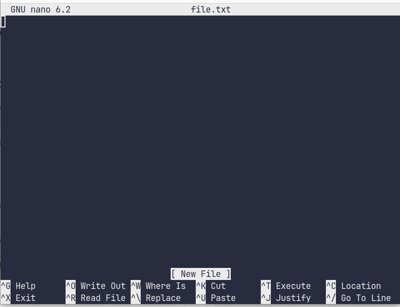

# Introduction

[note: a LOT of this document was copy-pasted directly from either the [FSL Course](https://open.win.ox.ac.uk/pages/fslcourse/website/online_materials.html) or [Andy Brain Book](https://andysbrainbook.readthedocs.io/en/latest/unix/Unix_Intro.html)]

## Types of Images

The most common MRI sequences are T1-weighted (T1w) and T2-weighted (T2w) scans. For neuroimaging, in general, T1- and T2-weighted images can be easily differentiated by looking at the CSF. CSF is dark on T1-weighted imaging and bright on T2-weighted imaging. In adults, on T1w images, greymatter is grey and whitematter is white. The opposite is true for T2w.

{ width=300px }

## Viewing Planes

The above images demonstrate one of three planes in which we tend to view images: axial (above, and below left), sagittal (middle), and coronal (right)

- the axial plane is parallel to the ground and separates the head (Superior) from the feet (Inferior)
- the coronal plane is perpendicular to the ground and separates the front from (Anterior) the back (Posterior)
- the sagittal plane separates the Left from the Right


## Orientation

The above image is shown in what is called 'Radiological' orientation. In Radiological orientation, the right side is shown on the left. This orientation can be imagined as if you are facing towards the patient or viewing the patient from below. In this case, the patient's left hemisphere would be displayed on the right side of the screen.

The neurological orientation (below) is as if you are viewing the patient from behind or above. The patient’s left side would then also be displayed on the left side of the screen.


Hopefully this image helps:

{ width=300px }

## Matrices and Voxels

Before we continue, it would probably be useful to define a voxel. In neuroimaging, we are usually working with a 3D matrix: essentially a big block that is divided into smaller blocks:

{ width=200px }

In the above picture, each smaller block (one is highlighted in green) is called a 'voxel'. A voxel is just a 3D pixel.

If we were to zoom in on an MRI scan, we would be able to see how the image is composed of voxels, with each voxel having a different signal value:

{ width=300px }

## Image Coordinate System

### Anatomical Coordinate System

All MRI data will have a coordinate system. You can think of this coordinate system as telling us where in space the image is. 

Usually the centre of the image will be at (0,0,0). If I move my cursor (green arrow) in the superior direction, I will be moving in the positive z direction (0,0,+). If I move it to the right, I will move in the positive x direction (+,0,0). Finally, if I move in the anterior direction, I will move in the positive y direction (0,+,0). This particular coordinate system is referred to as RAS (Right, Anterior, Superior) for the positive values.

### Image Coordinate System

In addition to the intensity value of each voxel (i j k) the origin and spacing of the anatomical coordinates are stored too. 

- The origin represents the position of the first voxel (0,0,0) in the anatomical coordinate system, e.g. (100mm, 50mm, -25mm)
- The spacing specifies the distance between voxels along each axis, e.g. (1.5mm, 0.5mm, 0.5mm)

The following 2D example shows the meaning of origin and spacing: 

{ width=200px }

### Image and Anatomical Coordinates:

Thus, if I am at the origin in anatomical space (0mm, 0mm, 0mm) or the centre of the image, I will be at some non-zero voxel location (e.g. (129, 119, 151)):

![Coordinates [0,0,0]](image-11.png){ width=300px }

But if I go to voxel location (0,0,0), which will be the most right, inferior, and posterior position, I will be at some non-zero anatomical location:

![Voxel location [0,0,0]](image-12.png){ width=300px }

# Command Line Interface

[note: I borrowed heavily from Andy Jahn and his [website](https://andysbrainbook.readthedocs.io/en/latest/unix/Unix_01_Navigation.html) ]

Before we move on, depending on how familiar you are, it may be a good idea to learn about the command line. If you are pretty confident already in this topic, you can skip to MRI Data Formats.

You may be used most used to interacting with a computer through point and click functions. For example, when you are browsing the web, you are likely pointing and clicking with your mouse and then typing things every now and then. However, there is another way to interact with the computer called the "command line interface", or command line for short.

Instead of pointing and clicking, you type the commands that you want to run. The command line is typed in a Terminal, a window in which you can only type text.

{ width=500px }

While this may look weird, in fact using the command line will allow you to eventually perform some very powerful functions. Here are some examples:

1. Allows you to perform batch processing, automate repetitive tasks, and manage data efficiently. This can save time and reduce the risk of errors.

2. Scripting and automation: write scripts and automate data processing pipelines. This is especially important for complex analyses involving multiple steps, as it ensures reproducibility and consistency in results.

3. Flexibility and customization: The command line offers a high level of flexibility, allowing you to customize analyses to their specific research needs. This level of control is often not easily achievable through graphical user interfaces (GUIs).

4. Access to advanced tools: Some powerful neuroimaging software tools are primarily available through the command line. Learning the CLI enables scientists to take advantage of these advanced tools and algorithms for their research.

5. Reproducibility and collaboration: Using the command line helps ensure that neuroimaging analyses can be easily reproduced by other researchers. Collaborators and colleagues are more likely to understand and validate the methods if they are well-documented and scripted in the CLI.

7. Integration with other tools: The command line allows seamless integration with other software and packages. Neuroimaging scientists often need to combine data from various sources, and CLI proficiency facilitates data merging and interoperability.

8. High-performance computing: Command line tools are well-suited for running computations on high-performance computing clusters. Neuroimaging analyses can be resource-intensive, and using the CLI efficiently distributes tasks across computing nodes.

10. Troubleshooting and debugging: When errors occur during data processing or analysis, the command line provides detailed feedback and error messages, making it easier to troubleshoot and debug the issues.

11. Version control: Neuroimaging projects can be complex and undergo multiple revisions. Command line proficiency makes it easier to manage version control systems, such as Git, enabling efficient collaboration and tracking of changes.

12. Career advancement: Proficiency in the command line is a valuable skill in the scientific community. It can enhance a neuroimaging scientist's resume and open up opportunities for collaboration, research projects, and positions that require strong technical skills.

## Navigating

To navigate around your computer, you will need to know the commands `pwd`, `cd`, and `ls`. `pwd` stands for “print working directory”; `cd` stands for “change directory”; and `ls` stands for “list”, as in “list the contents of the current directory.” This is analogous to pointing and clicking on a folder on your Desktop, and then seeing what’s inside. 

Navigate to the Desktop by typing `cd ~/Desktop`. Type `pwd` and note what the path is. Then create a new directory using the `mkdir` command, choosing a name for the directory on your own (e.g. `mkdir my_new_directory`). Navigate into that new directory and think about how your current path has been updated. Does that match what you see from typing `pwd` from your new directory?

## Copying and Removing Files

Now that you have experience getting around your directories with `cd` and `ls`, let’s expand our repertoire with the commands `cp`, `mv`, and `rm`. These are file manipulation commands, analogous to right clicking on a file and copying and pasting it, renaming or moving it to a folder, or moving it to the trash bin. The `cp` and `mv` commands are more complex than the commands in the previous tutorial, since they require two inputs, or arguments. We will also use these commands to introduce the concept of options, or flags, which give your commands greater flexibility.

To see the similarities between using the graphical interface and using the command line, create a text file in an editor of your choice, such as TextEdit. Save the file to your Desktop - in this example, I’ll call it myFile.txt - and try the following commands, remembering to press the Enter key after each line:

```bash
cp myFile.txt myFile2.txt
mv myFile.txt myNewFile.txt
rm myFile2.txt
```

The first line creates a copy of myFile.txt and labels it myFile2.txt; the second line renames myFile.txt to myNewFile.txt; and the last line removes myFile2.txt. As you type these in the command line you should see the files being copied, renamed, and deleted - just as you would if you were using your mouse with the graphical user interface.

> **WARNING** There is one important difference between the GUI and the command line when removing files and directories. A file that is removed using the GUI will first be put it in the Trash bin, and will only be permanently deleted if you choose to empty the Trash bin. Removing a file with `rm`, on the other hand, permanently deletes the file right away; you will not be able to recover the file after you remove it with `rm`!
<br> One option is to use `rm -i` so that you will be prompted before every removal (or use `rm -I` to prompt you once)

For now this is enough to enable us to work with some MRI data...

# MRI Data Formats

Different MRI vendors (Siemens, Philips, GE) will produce different outputs for the scans:
- **GE**: many .dcm files
- **Philips**: one .PAR and one .REC file 
<br>[note: you can ask your Philips MRI tech to produce DCM files as output as well]
- **Siemens**: ?

Typically, scientists will convert these formats to a more standard format to work with. That format is usually Nifti (Neuroimaging Informatics Technology Initiative). For each scan, you will typically end up with a single nifti file, with the suffix **.nii**

[ note: You may encounter other formats, such as .hdr/.img (SPM) or .head/.brik (AFNI), or even .mgz (Freesurfer). But for now we will only cover nifti ]

Nifti files can be stored and analyzed in a compressed format using gzip. In which case the image file may end in **.nii.gz**

Most MRI software will be able to handle the file in the .gz format, without the need to unzip.

## Convert to Nifti

The program we use to convert dicom to nifti is [dcm2niix](https://github.com/rordenlab/dcm2niix)

Simple example:

```bash
dcm2niix -o ~/outdir ~/dicomdir
```

The above will convert dicom files found in ~/dicomdir to nifti files, and output converted files into ~/outputdir

### Commonly Used Options

`-b <y/i/n>`

    Save additional BIDS metadata to a side-car .json file (default y). 
    The "i"nput-only option reads DICOMs but saves neither BIDS nor NIfTI.
    
`-ba <y/n> anonymize BIDS (default y).`

    If "n"o, side-car may report patient name, age and weight.

`-f <format>`

    Format string for the output filename(s). The following specifiers are supported:

        %a, antenna (coil) name
        %b, basename (filename of 1st DICOM file)
        %c, comments
        %d, description
        %e, echo number
        %f, folder name
        %i, patient ID
        %j, series instance UID
        %k, study instance UID
        %m, manufacturer
        %n, patient name
        %o, media object instance UID
        %p, protocol
        %r, instance number (of 1st DICOM file)
        %s, series number
        %t, time
        %u, acquisition number
        %v, vendor
        %x, study ID
        %z, sequence name

    The default format string is "%p_%e_%4s".

`-x <y/n/i>`

    Crop images. This will attempt to remove excess neck from 3D acquisitions. 
    If "i", images are neither cropped nor rotated to canonical space.

`-z <y/i/n>`

    Desired compression method. The "y"es option uses the external program pigz if available. 
    The "i" option compresses the image using the slower built-in compression routines.

**Example**

```bash
dcm2niix -z y -f %p_%t_%s -o /path/output /path/to/dicom/folder
```
 will save data as gzip compressed, with the filename based on the protocol name (%p) acquisition time (%t) and DICOM series number (%s), with all files saved to the folder "output". For more help see help: dcm2niix -h

### Try It Yourself

I have uploaded some data [here](https://drive.google.com/drive/folders/1ac22aIQ4ds9meZZ_xUUqrq42wl6KfJJa?usp=sharing)

You will see there is a folder called 'T1w_DICOM'

In a terminal, try converting these dicom files to nifti. First we will create a directory to put your nifti files:

```bash
mkdir T1w_NIFTI
```

For data from our GE Scanner (which is where this DICOM is from), I find the following options are best

```bash
dcm2niix -z y -f %s_%d -o ./T1w_NIFTI ./T1w_DICOM
```

where './' is saying to look for those directories in the current directory you are in (wherever you decided to place the T1w_DICOM files, for example)


# Visualize

Now that we have a nifti file to work with, let's take a look at what we converted.

The program we most often use to visualize nifti files is FSLeyes (pronounced fossil-eyes; but a lot of people just say F S L eyes)

There is a lot to go over, and I recommend you watch FSL's videos and read their instructions on [their course website](https://open.win.ox.ac.uk/pages/fslcourse/website/online_materials.html#preprac).

To install FSL and FSLeyes on your computer, [visit their website](https://fsl.fmrib.ox.ac.uk/fsl/fslwiki/)

In the command line, you can call fsleyes by simply typing that. You may want to include an '&' after in order to continue using the terminal window you launched it from:

```bash
fsleyes &
```

When you first load it up, this is what you will see:


To load an image, you can click *File > Add from file* (or Ctrl+O)

Go ahead and load the nifti file you just created. It should look something like this:


Go ahead and click on the image. If you click somewhere in the sagittal view, the coronal and axial will update to that location.

If you click and drag, you can see the other planes update in real-time

You could also hold down shift and scroll with your mouse wheel to travel through a plane

Or holding down ctrl and scrolling with your mouse wheel will zoom.

Right click and drag on a canvas to draw a zoom rectangle. When you release the mouse, the canvas will zoom in to that rectangle.

## Image Information

In the bottom right corner of the FSLeyes window you will find the location panel, which contains information about the current cursor location, and image data values at that location.

The controls on the left show the cursor location in "world" coordinates (millimetres). This coordinate system will change depending upon whether your image is in native subject coordinates (what you are currently in), standard template coordinates (e.g. MNI152; we'll discuss this more later), or some other coordinate space.

The controls in the middle show the cursor location in voxel coordinates, relative to the currently selected image. If the currently selected image is 4D (e.g. a time series image), the bottom control displays the currently selected volume (e.g. time point).

The area on the right displays the intensity value and voxel location at the current cursor location for all loaded images. Note that if you have images with different resolutions loaded, the voxel location will be different for each of them.

## Display Toolbar


1. Overlay display panel: Clicking on the gear button opens a panel with more display settings.
2. Overlay information: Clicking on the information button opens a panel with information about the image.
3. Overlay name: You can change the image name here.
4. Overlay type: FSLeyes allows some images to be displayed in different ways. This should be set to "3D/4D volume" most of the time.
5. Opacity: Adjust the opacity (transparency) here.
6. Brightness/contrast: Quickly adjust the image brightness and contrast here.
7. Display range: Use these fields for fine-grained control over how the image data is coloured, instead of using the brightness and contrast sliders.
8. Colour map: Choose from several different colour maps.
9. Enable -ve colour mapIf you are viewing an image that has both positive and negative values, this button allows you to enable a colour map that is used for the negative values.
10. -ve colour map:Choose a colour map for negative values here.

## Ortho Toolbar

By default you are in the 'ortho' view. This means we get a sagittal, coronal and axial view.


 The ortho toolbar allows you to adjust and control the ortho view. Play with the controls, and try to figure out what each of them do.

1. View settings panel: Clicking on the spanner button opens panel with advanced ortho view settings.
2. Screenshot: Clicking on the camera button will allow you to save the current scene, in this ortho view, to an image file.
3. Toggle canvases: These three buttons allow you to toggle each of the three canvases on the ortho view.
4. Canvas layout: These three buttons allow you to choose between laying out the canvases horizontally, vertically, or in a grid.
5. Movie mode: This button enables movie mode - if you load a 4D image, and turn on movie mode, the image will be "played" as a movie (the view will loop through each of the 3D images in the 4D volume).
6. Toggle cursor/labels: This button () allows you to toggle the anatomical labels and location cursor on and off.
7. Reset zoom: This button resets the zoom level to 100% on all three canvases.
8. Zoom slider: Change the zoom level on all three canvases with this slider.

## Lightbox View

Open a lightbox view using *View > Lightbox View*. If you drag the mouse around in the viewer you can see that the cursor position is linked in the two views of the data (the ortho and the lightbox views). This is particularly useful when you have several images loaded in at the same time (you can view each in a separate view window and move around all of them simultaneously).


The lightbox view has a slightly different toolbar to the ortho toolbar.

1. View settings panel: Clicking on the spanner button opens a panel with advanced lightbox view settings.
2. Screenshot: Clicking on the camera button will allow you to save the current scene, in this lightbox view, to an image file.
3. Z axis: These three buttons allow you to choose which slice plane to display in the lightbox view.
4. Movie mode: This button enables movie mode.
5. Slice range: These sliders allow you to control the beginning and end points of the slices that are displayed.
6. Zoom: This button allows you to control how many slices are displayed on the lightbox view.
7. Slice spacing: This slider allows you to control the spacing between consecutive slices.

## Add Color Bar

To add a color bar (which will tell the viewing the range of values being displayed): 

- Click on the Wrench icon
- Under 'Scene settings', click on 'Show colour bar []'
- I don't like having it at the top, so you can change the location to the right: 
- Click on 'Colour bar location' and change to 'Right'
- You can also change the color bar size, and label size


Thus, we see that values that are black are 0, and value that are white are 3,033 (arbitrary units)

## Command line FSLeyes options

If you type `fsleyes -h` in a terminal window, you will get the following, which you can use to load an image in a very particular way:

> FSLeyes version 1.5.0 <br>
Usage: fsleyes [options] file [displayOpts] file [displayOpts] ... <br>
  -h, --help       Display basic FSLeyes options and exit <br>
  -fh, --fullhelp  Display all FSLeyes options and exit <br>
Examples: <br>
fsleyes --help <br>
fsleyes --fullhelp <br>
fsleyes [options] T1.nii.gz --cmap red <br>
fsleyes [options] MNI152_T1_2mm.nii.gz -dr 1000 10000 <br>
fsleyes [options] MNI152_T1_2mm.nii.gz -dr 1000 10000 zstats.nii.gz -cm hot -dr -5 5 <br>
Display options<br>
  -a PERC, --alpha PERC <br>
                        Opacity (0-100, default: 100) <br>
  -dr LO HI, --displayRange LO HI <br>
                        Display range <br>
  -cr LO HI, --clippingRange LO HI <br>
                        Clipping range. Setting this will override the display
                        range. <br>
  -cm CMAP, --cmap CMAP <br>
                        Colour map<br>
Available colour maps: blue, blue-lightblue, brain_colours_1hot, brain_colours_1hot_iso, brain_colours_2winter, brain_colours_2winter_iso, brain_colours_3warm, brain_colours_3warm_iso, brain_colours_4cool, brain_colours_4cool_iso, brain_colours_5redyell, brain_colours_5redyell_iso, brain_colours_6bluegrn, brain_colours_6bluegrn_iso, brain_colours_actc, brain_colours_actc_iso, brain_colours_blackbdy, brain_colours_blackbdy_iso, brain_colours_bluegray, brain_colours_bluegray_iso, brain_colours_bone, brain_colours_bone_iso, brain_colours_cardiac, brain_colours_cardiac_iso, brain_colours_cortex, brain_colours_cortex_iso, brain_colours_diverging_bgy, brain_colours_diverging_bgy_iso, brain_colours_diverging_bwr, brain_colours_diverging_bwr_iso, brain_colours_flow, brain_colours_flow_iso, brain_colours_french, brain_colours_french_iso, brain_colours_ge_color, brain_colours_ge_color_iso, brain_colours_gold, brain_colours_gold_iso, brain_colours_gooch, brain_colours_gooch_iso, brain_colours_greengray, brain_colours_greengray_iso, brain_colours_hotiron, brain_colours_hotiron_iso, brain_colours_nih, brain_colours_nih_fire, brain_colours_nih_fire_iso, brain_colours_nih_ice, brain_colours_nih_ice_iso, brain_colours_nih_iso, brain_colours_nih_new, brain_colours_nih_new_iso, brain_colours_pink, brain_colours_pink_iso, brain_colours_rainramp, brain_colours_rainramp_iso, brain_colours_redgray, brain_colours_redgray_iso, brain_colours_spectrum, brain_colours_spectrum_iso, brain_colours_surface, brain_colours_surface_iso, brain_colours_x_hot, brain_colours_x_hot_iso, brain_colours_x_rain, brain_colours_x_rain_iso, cool, copper, cortical, green, greyscale, hot, hsv, pink, random, red, red-yellow, render1, render1t, render2, render2t, render3, retino, subcortical, yellow. You can also specify any matplotlib colour map, or a colour map file.

## Other MRI Visualizing Tools

Briefly, other MRI visualizing programs should be mentioned:

- **3D Slicer**: This is a good option for people who won't be getting deep into neuroimaging. For example, a friend who just wants to view their brain after volunteering for a scan. More info on [their website](slicer.org) or the [lab wiki](https://bcchr.atlassian.net/wiki/spaces/WRT/pages/224034839/3D+Slicer)
- **Freeview**: Freeview is part of the popular segmentation program Freesurfer. Freesurfer is very powerful for segmentation and cortical surface reconstruction. Check out this wiki on [their website](https://surfer.nmr.mgh.harvard.edu/fswiki/FsTutorial/OutputData_freeview), or the [lab wiki](https://bcchr.atlassian.net/wiki/spaces/WRT/pages/224166050/freesurfer)
- **mrview**: MRView is part of MRtrix3, a set of tools to perform various types of diffusion MRI analyses. I find it does really good a 3D rendering and virtual dissection (see below). Check out [their website](https://www.mrtrix.org/) or the [lab wiki](https://bcchr.atlassian.net/wiki/spaces/WRT/pages/224035174/Mritrix3)

# Skull Strip

A lot of the times, something we will want to do with our data is 'skull-strip' it. Which is a morbid way of saying we want to remove all non-brain elements from our data. It is AKA brain extraction.

There are several different programs with pros and cons for brain extraction. But for now, let's just stick with the one provided with our FSL installation: `bet` (brain extraction)

The basic command line uage of bet is:

```bash
bet <input> <output> [options]
```

### Try It Yourself

Move to your T1w_NIFTI folder (`cd T1w_NIFTI`) and type:

```bash
bet 3_SAG_FSPGR_3D_.9X.9X.9.nii.gz brain
```

This should run relatively quickly. Let's take a look at our results.

## FSLeyes Overlay

Load in the brain image you just created (brain.nii.gz) in FSLeyes using *File > Add from file*. In the bottom-left panel is a list of loaded images - the overlay list. If you closed your previous FSLeyes session, add in your original T1w image too.

The overlay list shows the images which are currently loaded into FSLeyes. When you select an image in this list, it becomes the currently selected image - in FSLeyes, you can only select one image at a time.

You can use the controls on the display toolbar to adjust the display properties of the currently selected image. Select the image you just loaded (brain.nii.gz), and use the display toolbar to change its colour map to 'Blue-Light blue'.

The overlay list allows you to do the following:

- Change the currently selected overlay, by clicking on the overlay name.
- Identify the currently selected overlay (highlighted in blue).
- Add/remove overlays with the + and - buttons.
- Change the overlay display order with the ▲ and ▼ buttons.
- Show/hide each overlay with the eye button, or by double clicking on the overlay name.
- Link overlay display properties with the chainlink button.
- Save an overlay if it has been edited, with the floppy disk button.
- Left-click and hold the mouse button down on the overlay name to view the overlay source (e.g. its location in the file system).

You will want to make sure your brain image is 'above' or overtop of your T1w image. Click on your brain file and click the ▲ button until it is on top. You should now see something like this:


As you can see, the bet program using default settings has done an ok job.... but not great. It looks like it included a lot near the brain stem that we don't want. Let's try again.

## BET Troubleshooting

### Varying the fractional intensity threshold parameter (-f)

Using the command line, try setting the Fractional intensity threshold (the -f option on the command line) to 0.2 and 0.8, in turn, to see the effect it has (save these with different output image names and load both into FSLeyes). This option controls the threshold that distinguishes brain from non-brain; if you reduce it from the default value of 0.5 then the brain estimate gets larger, and vice versa.

### Using the gradient threshold option (-g)

You can also adjust the gradient threshold (from its default of 0), which causes the overall fractional threshold (controlled globally by -f) to vary linearly with slice number - to get smaller at the bottom and bigger at the top (<0), or vice versa (>0). 

For example, if you run this with -g 0.2, you will probably find that we have now underestimated the top slices. However by combining the gradient option with the main (-f) option, we can get a good overall result: try -f 0.8 -g -0.2 (or maybe you can do even better!)


It looks like we have both gotten a little bit better of a result, and a little bit worse (using -f 0.8 and -g -0.2 displayed in red).

### Cropping your image beforehand

Often times removing the excess neck that we acquire can help with skull-stripping.
To accomplish this, you can try running `robustfov`

```bash
robustfov -i 3_SAG_FSPGR_3D_.9X.9X.9.nii.gz -r T1w_crop
```

where in this instance I have named the output as 'T1w_crop'

### Using the -B and/or the -R option

- Adding the -R flag will re-run bet several times, each starting its brain centre of the previously estimated brain.

- Finally, you can try using the -B flag, which will perform bias field and neck clean up. In a recent paper, they found the optimized bet protocol was to use -B and -f 0.1 <br> [paper here](https://pubmed.ncbi.nlm.nih.gov/22484407/)

>"The removal of the neck slices, either externally or within BET, has a marked positive effect on the brain extraction quality. BET option "B" with f=0.1 after removal of the neck slices seems to work best for all acquisition protocols."

### Moving Forward

I found the `T1w_crop.nii.gz` file led to the best results, so I will be using that moving forward in this tutorial as our T1w file.

## 3D Rendering

Now that we have a brain extracted, it could be fun to visualize this in 3D. FSLeyes can help.

Go to *View > 3D View*

Select only the best brain extracted image you got.

{ width=300px }

Play around with the settings.

### Virtual Dissection

Click on the Gear Wheel

Near the bottom, there is '3D display settings'

To add a 'clipping' plane (essentially the plane you will dissect with), click the up arrow for 'Number of clipping planes'

If you add 3, they will automatically be the three orthoganol planes. If you don't like how they are clipping, you can rotate or change clipping mode.

Hard to see as a 2D image:

{ width=300px }

## Other Skull Stripping Tools

Briefly, other MRI skull stripping programs should be mentioned:

- **3dSkullStrip**: This is part of AFNI, another popular MRI analysis software suite. Visit [their website](https://afni.nimh.nih.gov/) or the [lab wiki](https://bcchr.atlassian.net/wiki/spaces/WRT/pages/224100372/AFNI)
- **ANTs and ANTsPyNet**: ANTs is becoming very popular, and is best known for its superior registration (see below). There is a python deep learning version of ANTs that does an incredible job of skull stripping (and fast too!): [website](https://github.com/ANTsX/ANTsPyNet) or [lab wiki](https://bcchr.atlassian.net/wiki/spaces/WRT/pages/224133391/Anatomical#ANTsPyNet)
- **BEaST**: BEaST is a specialized brain extraction program. It's hard to install, but does a really good job. [Website](https://www.mcgill.ca/bic/software/tools-data-analysis/anatomical-mri/beast) and [lab wiki](https://bcchr.atlassian.net/wiki/spaces/WRT/pages/224133391/Anatomical#BEaST)

# Command line FSL Utils

Let's take a second to explore some more utilities FSL has:

## fslinfo and fslhd

These tools enable various properties of an image to be viewed.

Type `fslinfo brain.nii.gz` 

we get:

>data_type	FLOAT32
dim1		190
dim2		256
dim3		189
dim4		1
datatype	16
pixdim1		0.900000
pixdim2		0.898400
pixdim3		0.898400
pixdim4		0.008296
cal_max		0.000000
cal_min		0.000000
file_type	NIFTI-1+

Which tells us the data is stored as a 32bit float (can take on fractional values, as opposed to `int` which would just be integers), has 190 voxels in the x direction, 256 in the y, and 189 in the z. This is a 3D image as the fourth dimension is 1. If dim4 was > 1, we would have multiple volumes. For example, in fMRI scans, we acquire multiple volumes across time. `pixdim` gives the size of each dimension in mm. `file_type`

Also try running `fslhd` on this same file. This provides much more detailed information about the images. Don't worry if you don't know what every field means.

## fslstats

`fslstats` is a general tool for calculating various values/statistics from the image intensities. It is quite flexible but we will just illustrate some basic uses here. Type `fslstats` to see the full list of possible options and brief description of the output. Any combination and order of options is possible.

Run:

```bash
fslstats brain -m -M
```

The first number is the mean intensity of all voxels in image, whilst the second is the mean of only the non-zero voxels. The first is much lower because of all the zero background voxels dragging down the mean. The second number is a more meaningful mean of the actual within-brain intensities - view the image and click around inside the brain to see this.

## fslmaths

`fslmaths` is a very general image calculator and can be used to perform a great variety of manipulations of images. See the (long) usage by just typing `fslmaths`. Don't worry about understanding it all at this point, we will illustrate some basic uses here, but be aware that it is a very general and powerful tool that is worth getting to know.

A silly example, as we don't have much data to work with yet, would be to get the brain-stripped image:

```bash
fslmaths T1w_crop.nii.gz -sub brain skull
```

Take a look at the output. Essentially, we told fslmaths to: "take the T1 image, subtract the brain from that image, now output the result as 'skull'"

[note: this might not work if you used `robustfov`. In which case, perform the above but with the cropped T1 image instead of the original]


## More utils

other utilities you might find interesting are:

- `fslsplit`: which can split an image up into volumes (if it's originally 4D), or slices (from 3D to 2D slices). Type `fslsplit` on it's own to get the usage
- `fslmerge`: which can merge slices to create a volume, or merge volumes to create a 4D image. Again, type `fslmerge` to get its usage
- `fslroi` is similar to fslsplit but gives you more control on how many time-points or how many slices to split out. Type `fslroi` to learn more.

### Example

If you wanted to crop an image to the smallest size that contains non-zero voxels:

```bash
fslstats brain.nii.gz -w
```

will tell you what values to input to `fslroi`:

```bash
fslroi brain brain_roi $(fslstats brain -w)
```

which the `$()` essentially says "run the following, and use the output as input"

# Registration

Often times we find it important to 'register' two images together. What this means is, depending on how agressive we want to be, we might **rotate**, **translate**, **shear**, **warp**, etc. one image - let's call it the moving image - to look like another - the 'fixed' image. When we do that, we will also end up with some kind of registration matrix that contains the information necessary to perform the registration (moving to fixed). Then we could use that matrix to extend the same registration to other images that are the the same 'space' as our 'moving' image. Or we can inverse the matrix and apply it to do the reverse direction registration for images in the same 'space' as the fixed image. 

"Being able to achieve precise registrations is CRUCIAL for structural, functional and diffusion image analysis. If registrations are not accurate, further statistics at a structural or group level will not be accurate."

For this example, we will focus on registering our anatomical scan and 'normalizing' it to a shared atlas space. This atlas is usually created by registering and averaging a bunch of people's brains together. 

## MNI Space

Let's take a second to explore one of these atlases or 'standard' spaces in more detail. We will take the Montreal Neurological Institute's (MNI) 152 brain. This is an average of 152 healthy adult brains, which represent the population that most studies draw from. If you are studying another population - such as children or the elderly, for example - consider using a template created from representatives of that population (see [TemplateFlow](https://www.templateflow.org) for examples)

You can load the MNI152 T1w image by opening FLSeyes, then clicking *File > Add standard*, and then choosing MNI152_T1_1mm.nii.gz, where 1mm is the resolution:


One thing we can do with this standard image, is we can use FSLeyes' 'Atlas Panel' to tell us what, when we click on a location in the brain, what specific region that is. 

Click *Settings > Ortho View 1 > Atlases*


Now, when you click around, you will get information such as you see above.

Therefore, if we successfully can register our example T1w image to this space, we can know exactly where in the brain we are looking at.

You can also click on the *Atlas Search* tab to find the region you are looking for.

## Linear Registration

The first step in this process is to first perform a 'linear' registration. This is sometimes also called 'affine' registration. 

In FSL, `flirt` is the main program that performs affine registration. It stands for FSL's Linear Image Registration Tool. 

The main options are: an input (the moving image) (`-in`) and a reference/fixed (`-ref`) volume; the calculated affine transformation that registers the input to the reference which is saved as a 4x4 affine matrix (`-omat <output_matrix_name.mat`); and output volume (`-out <output_file_name`) where the transform is applied to the input volume to align it with the reference volume. In addition, FLIRT can also be used to apply a saved transformation to a volume (`-applyxfm -init <matrix.mat>` ) or to apply a transform that aligns the NIFTI mm coordinates (`-applyxfm -usesqform`). For these usages the reference volume must still be specified as this sets the voxel and image dimensions of the resulting volume.

### Features:

**Cost Function Weighting**

Weighting volumes can be specified using `-refweight`, `-inweight` (or both). This allows the cost function to have a different weighting at each voxel, which is useful for excluding areas (weight=0) of no interest, or increasing the weighting around important structures such as the ventricles. Note that this is different from masking the original images, as masking introduces artificial boundaries whereas weighting does not.

**Degrees of Freedom**

 The setting of the "degrees of freedom" (DoF) determines the what types of change (distortion) may be made to the registered images to make them align with the fixed image. There are are four basic types of distortion that can be applied to the images:

- Translation: Shifts in the x (horizontal), y (vertical) and z (through-plane) directions.
- Rotation: Rotations about the x, y and z axes.
- Scale. Enlargement (scale > 1) or shrinkage (scale < 1) of the images in the x, y and z directions. 
- Shear. This causes a "trapezoidal" distortion of the image. For example, an xy shear causes a horizontal shift in the image that depends on the y-location. This is illustrated in the picture, where the an xy shear has been applied, and the original image is shown in green underneath.


Choose from **6,7,9 or 12** Degrees of Freedom (DOF) for full 3D registrations. More flexible DOF options are provided by the specific schedule files provided in `$FSLDIR/etc/flirtsch`.

- 6 DOF is also called **rigid body registration**
- 12 DOF is called **affine** as already mentioned
- greater than 12 DOF is called **non-linear**

**Interpolation Methods**

Interpolation is essentially when you register and suddenly what was one voxel now resides between voxels, and so that initial intensity value needs to be 'interpolated' or guessed.

Options include Nearest Neighbour (no interpolation; **You may want to remember this one, as it can be handy when you apply a registration to a binary or indexed image**), a family of Sinc-based methods (three window types - rectangular, Hanning and Blackman) with configurable window width, and spline (a highly efficient method, with similar output characteristics to sinc). The interpolation is only used for the final transformation (and in applyxfm), not in the registration calculations.

**Cost Functions**

The **cost function**  is the measure of 'goodness' of alignment. Seeks the minimum value.
This includes: 
- within-MRI-modality (i.e. MRI-to-MRI, same sequence; as opposed to MRI-to-CT or MRI(T1w)-to-MRI(T2w)) functions Least Squares and Normalised Correlation
- between-MRI-modality (i.e. MRI(T1w)-to-MRI(T2w)) function Correlation Ratio (the default);
- as well as the between-modality (i.e. MRI-to-CT/PET) Mutual Information and Normalised Mutual Information. 
- In addition, there is the BBR cost function which utilises a segmentation of the reference image to define a boundary, and it is the intensity differences in the input image, across the transformed boundary, that contribute to the cost. 

**Some default options**

`-cost`: default is *corratio*<br>
`-interp`: default is *trilinear*<br>
`-dof`: default is *12*

### Example

Flirt is typically more robust when data has been brain-exatracted first.

Let's perform a linear registration of our T1w brain to the standard space (MNI152) brain:

```bash
flirt -in brain.nii.gz -ref $FSLDIR/data/standard/MNI152_T1_1mm_brain.nii.gz \
 -out T1w-to-MNI -omat T1w-to-MNI.mat
```

Let's take a look at our result:


You'll have to load this yourself to get a better idea. I change the underlay (MNI) and overlay (T1w-to-MNI.nii.gz) colors to blue and yellow and then adjusted the opacity for the overlay. The brighter blue sections show where the brains are least lined-up.


### convert_xfm

`convert_xfm` is a utility that is used to convert between different transformation file formats. It can read and write ascii 4x4 matrices. In addition, it can be used to concatenate two transforms (using -concat with the second transform) or to find the inverse transformation (using -inverse). 

**Examples:**

To invert a saved transformation:

```bash
convert_xfm -omat refvol2invol.mat -inverse invol2refvol.mat
```

To concatenate two transformations:

```bash
convert_xfm -omat AtoC.mat -concat BtoC.mat AtoB.mat
```

Note that the transform after the `-concat` is treated as the second transformation in the concatenation. 

## Nonlinear Registration

Now let's perform a non-linear registration of our T1w-to-MNI image to MNI. 

For this we will use FSL's `fnirt`, where the n is for non-linear.

While `flirt` typically uses brain extracted files, `fnirt` takes non-extracted data. 

`fnirt` can also take a config file. That's because `fnirt` has _many_ options we can specify (too many to go over here; for more reading, visit the [FSL User Guide](https://fsl.fmrib.ox.ac.uk/fsl/fslwiki/FNIRT/UserGuide))

However, other people have found which options work best for non-linear registration of a T1w scan to MNI_T1_1mm. One such config file can be downloaded from [here](https://github.com/Damangir/Cascade0/blob/master/data/config/T1_2_MNI152_1mm.conf)

Download that file and place it in your current working directory (or `$FSLDIR/etc/flirtsch/` if you think you'll want to use this again in the future). You see, when you specify `--config=my_file`, without explicit path or extension, `fnirt` will search for `./my_file`, `./my_file.cnf`, `${FSLDIR}/etc/flirtsch/my_file` and `${FSLDIR}/etc/flirtsch/my_file.cnf` in that order and use the first one that is found. 

Therefore, we will perform the following:

```bash
fnirt --in=T1w_crop.nii.gz --ref=${FSLDIR}/data/standard/MNI152_T1_1mm \
--aff=T1w-to-MNI.mat --cout=T1w-to-MNI_nonlin --config=T1_2_MNI152_1mm.conf
```

Finally, we use `applywarp` to apply this warp to our file:

```bash
applywarp --in=T1w_crop.nii.gz --ref=${FSLDIR}/data/standard/MNI152_T1_1mm \
--warp=T1w-to-MNI_nonlin --out=T1w-to-MNI_warped
```

Results:


Once again I set the background as blue and the foreground as yellow and reduced the opacity of the foreground (T1w-to-MNI_warped). It looks good, but definitely did some weird skull warping...

And now we can see where in the brain our cursor is with the Atlas.

### Inverse Direction

`invwarp` is used to 'reverse' a non-linear mapping, much in the same way as one would use 

`convert_xfm -omat B2A.mat -inverse A2B.mat` to 'reverse' a linear mapping.

It can be useful if one wants to use a set of ROI's that have been specified once and for all in standard space by projecting them into the space of individual subjects.

For example, if we had an `Thalamus_right.nii.gz` mask file, which you can get by running:

```bash
fslmaths $FSLDIR/data/atlases/HarvardOxford/HarvardOxford-sub-maxprob-thr50-1mm.nii.gz \
-thr 15 -uthr 15 -bin Thalamus_right
```

Now:

```bash
invwarp --ref=T1w_crop.nii.gz --warp=T1w-to-MNI_nonlin --out=MNI-to-T1w
```

```bash
applywarp --ref=T1w_crop.nii.gz --in=Thalamus_right \
--warp=MNI-to-T1w --out=Thalamus_right-to-T1w --interp=nn 
```

where `--interp=nn` is using nearest neighbour for interpolation.

Now take a look at this new `Thalamus_right-to-T1w` with your `T1w_crop` file and see what you see.


## Tips

- It is almost always better to register a low-resolution image to a higher-resolution image. If that is not the direction you intend, then you can always invert the registration and apply it the other direction.

## What do the transformations look like?

**Affine**

Am affine transformation is represented by 12 numbers. This matrix multiplies
coordinate vectors to define the transformed coordinates.

{ width=400px }

**Non-linear**

A non-linear transformation can be represented by a **deformation field.**

## Transforming Masks

Mask values are normally 0 and 1 (integer format). Interpolation during the registration process usually gives values in between 0 and 1. If we rounded to integer values, the mask would shrink. 

Therefore, what we need to do is re-threshold (binarize) the transformed mask.

"Correct" thresholding depends on the particular case:<br>
- Threshold near 0.0 to include partial-volume edges
- Threshold near 1.0 to exclude partial-volume edges
- Threshold at 0.5 to keep the same size (approx)

{ width=300px }

Example, after performing or applying a registration to a mask:

```bash
flsmaths mask-registered.nii.gz -thr 0.5 -bin mask-registered.nii.gz
```

Note, in this example I am overwriting the original. You may not want to do this...

## Other Registration Tools

Briefly, other MRI registrations programs should be mentioned:

- the main one you will probably want to know about is ANTs. It's not intuitive and has a steep learning curve, but is well worth the effort. I recommend just reading [their manual](https://raw.githubusercontent.com/stnava/ANTsDoc/master/ants2.pdf) (warning: it's long) or visiting the [lab wiki](https://bcchr.atlassian.net/wiki/spaces/WRT/pages/224165953/ANTs)

Example usage of ANTs:

**Affine**

```bash
fixed=$FSLDIR/data/standard/MNI_T1w_1mm.nii.gz
moving=T1w.nii.gz
antsRegistration --dimensionality 3 --float 0 \
        --output [./T1w_to_MNI_,./T1w_to_MNI_Warped.nii.gz] \
        --interpolation Linear \
        --winsorize-image-intensities [0.005,0.995] \
        --use-histogram-matching 0 \
        --initial-moving-transform [$fixed,$moving,1] \
        --transform Rigid[0.1] \
        --metric MI[$fixed,$moving,1,32,Regular,0.25] \
        --convergence [1000x500x250x100,1e-6,10] \
        --shrink-factors 8x4x2x1 \
        --smoothing-sigmas 3x2x1x0vox
```

**Nonlinear**

```bash
fixed=$FSLDIR/data/standard/MNI_T1w_1mm.nii.gz
moving=T1w.nii.gz
antsRegistration --dimensionality 3 --float 0 \
        --output [./T1w_to_MNI_,./T1w_to_MNI_Warped.nii.gz] \
        --interpolation Linear \
        --winsorize-image-intensities [0.005,0.995] \
        --use-histogram-matching 0 \
        --initial-moving-transform [$fixed,$moving,1] \
        --transform Rigid[0.1] \
        --metric MI[$fixed,$moving,1,32,Regular,0.25] \
        --convergence [1000x500x250x100,1e-6,10] \
        --shrink-factors 8x4x2x1 \
        --smoothing-sigmas 3x2x1x0vox \
        --transform SyN[0.1,3,0] \
        --metric CC[$fixed,$moving,1,4] \
        --convergence [100x70x50x20,1e-6,10] \
        --shrink-factors 8x4x2x1 \
        --smoothing-sigmas 3x2x1x0vox
```

# Segmentation

Now that we have 'segmented' the brain out of the full image we started with, let's keep going and segment the brain into distinct parts.

We can do this for both the cortex, and the subcortex.

## FAST

FSL has a program called `FAST`, which we can use to perform cortical segmentation.

It requires a brain-extracted image. Luckily, we just did that!

```bash
fast -B -o FAST brain.nii.gz
```

The `-B` option will output a bias-field corrected image <br>
the `-o` is telling the program what to name the outputs (up to you)<br>
And finally, we are using the brain-extracted image as the input

This will likely take between 10 and 15 mins.

When it is done running, you will have the following outputs:

>FAST_mixeltype.nii.gz
FAST_pve_0.nii.gz
FAST_pve_1.nii.gz
FAST_pve_2.nii.gz
FAST_pveseg.nii.gz
FAST_restore.nii.gz
FAST_seg.nii.gz

The important outputs are:

- FAST_restore will be the bias field corrected image
- FAST_seg will have white matter labeled with a signal intensity of 3, grey matter as 2, and CSF as 1 (CSF is cerebral spinal fluid... so essentially 'non-brain')
- FAST_pve_0...2 is the probability for each tissue type (called Partial Volume Estimates). So 0 is a mask of CSF and the probability that it belongs to CSF. Same with 1 (gm) and 2 (wm)

You can view the results all at once from the command line by typing:

```bash
fsleyes FAST_restore.nii.gz \
  FAST_pve_0 -cm green -dr 0.5 1 \
  FAST_pve_1 -cm blue-lightblue -dr 0.5 1 \
  FAST_pve_2 -cm red-yellow -dr 0.5 1 &
```

Which will give you the following:


[note: can you understand the fsleyes command above? what is -dr? what is -cm?]

Using one of the FSL Utils we learned, we can get some stats already:

```bash
fslstats FAST_pve_1 -M -V
```

Which gives us:

> 0.725243 1318256 957594.687500

The first tells us the average PVE for non-zero voxels for GM. The second is the number of voxels, and the third gives the volume in $mm^3$. Multiplying the first and third numbers together will give the total GM volume in mm3 (for more details on fslstats just type fslstats to see its usage description).

To get a binary mask of GM or WM, you will want to threshold and binarize the pme images.

Thus, for gm, we could do the following:

```bash
fslmaths FAST_pve_1 -thr 0.5 -bin GM
```

This will remove any GM that is below 0.5 PVE, and then convert everything else non-zero to 1 and output the image as GM.nii.gz


There definitely appears to be some tissue that has been identified as GM that probably shouldn't have been (can you find it?)

You could fix this by getting a better brain mask. Or by setting a higher threshold (0.7?)

## FIRST

Next let's try to segment the more sub-cortical structures using `FIRST`

```bash
run_first_all -b -i FAST_restore -o FIRST
```

- The `-b` flag tells the program we have already performed the brain extraction step
- You could alternatively tell it which structures you want to segment using the `-s` flag (e.g. L_Hipp)

This will take roughly 5-10 mins

### Check the registration

FIRST will register to MNI space in order to perform the segmentation by using an already segmented atlas.

Let's check this registration:

```bash
fsleyes /usr/local/fsl/data/standard/MNI152_T1_1mm.nii.gz -cm red-yellow -a 0.5 &
```

where `-a 0.5` tells fsleyes to load the brain overlay with 50% opacity. You can adjust this opacity to check how well the registration was.

### Segmentation Results

Next let's load the brain and all segmentation structures on top:

```bash
fsleyes FAST_restore FIRST_all_fast_firstseg -cm subcortical &
```

This *_firstseg image shows the combined segmentation of all structures based on the surface meshes that FIRST has fit to the image. It is in the native space of the structural image (not in the standard space, although the registration before was required to move the model from the standard space back into this image's native space). 


You could also compare the Thalamus right file you just created `FIRST-R_Thal_first.nii.gz` with the `Thalamus_right.nii.gz` file you created earlier. How do they compare?

## FSL_anat

Alternatively you could run `fsl_anat` to do most of what we just covered (crop, skull strip, segmentation, registration to MNI, etc.):

> This tool provides a general pipeline for processing anatomical images (e.g. T1-weighted scans).<br>
Most of the pipeline involves standard use of FSL tools, but the bias-field correction has been substantially improved, especially for strong bias-fields typical of multi-coil arrays and high-field scanners.<br>
The stages in the pipeline (in order) are:
>- reorient the images to the standard (MNI) orientation [fslreorient2std]
>- automatically crop the image [robustfov]
>- bias-field correction (RF/B1-inhomogeneity-correction) [FAST]
>- registration to standard space (linear and non-linear) [FLIRT and FNIRT]
>- brain-extraction [FNIRT-based or BET]
>- tissue-type segmentation [FAST]
>- subcortical structure segmentation [FIRST] 

### Usage

```bash
fsl_anat [options] -i <structural image>
```

type `fsl_anat` to get more details, or go to the [specific FSL wiki page](https://fsl.fmrib.ox.ac.uk/fsl/fslwiki/fsl_anat)

## Other Segmentation Tools

Briefly, other MRI segmentations programs should be mentioned:

- the main one you will probably want to know about is Freesurfer. However, freesurfer takes a while, and I have found, if you have at least 6 Gb of of GPU, you can use FastSurfer which really speeds things up. [Freesurfer website](https://surfer.nmr.mgh.harvard.edu/fswiki/FreeSurferBeginnersGuide) and [lab wiki](https://bcchr.atlassian.net/wiki/spaces/WRT/pages/224166050/freesurfer)
- SPM
- ANTs


# BIDS

BIDS stands for Brain Imaging Data Structure. It is an open-source effort to "standardize the way researchers store their data. BIDS provides a common, consistent directory hierarchy and naming system for files, as well as supporting ‘sidecar’ files for key associated data (like stimulus timing information for task fMRI). With a fixed standard for representing data, this has supported the creation of a number of ‘BIDS apps’, self-contained programs that can automatically process data arranged according to BIDS."

More info can be found on the [WeberLab wiki](https://bcchr.atlassian.net/wiki/spaces/WRT/pages/224133153/BIDS+Brain+Imaging+Data+Structure)

## dcm2bids

`dcm2bids` is a python wrapper that will use `dcm2niix` to convert data to nifti, but also name and store it in BIDS format.

```bash
pip install --upgrade dcm2bids
```

## Example

First create a folder where you want your BIDS directory for our example project to be:

```bash
cd ~/Desktop && mkdir myBIDSexample && cd myBIDSexample
```

now type:

```bash
dcm2bids_scaffold
```

This gives us several generics folders and files. One of the created folders is named `sourcedata/`

{ width=250px }

Go into the `sourcedata` directory and create a new directory for our example subject:

```bash
cd sourcedata && mkdir sub-01
```

place the dcm data here, then return to the main BIDS folder.

From here, type:

```bash
dcm2bids_helper -d sourcedata/sub-01
```

Which should spit out:

> Example in: /home/weberam2/Desktop/MRIFAQ_data/BIDS/tmp_dcm2bids/helper

If you navigate to that new folder, you will see a .json and a .nii.gz file named:

`003_sub-01_Research_-_DSBBEP_20200917132212`. Not super helpful, but it seems 003 refers to the Series number, sub-01 is our subject name we gave it, and the other information seems kind of useless to us. That's ok, we have enough here to work with.

Note: with GE data, I find this gives bad naming conventions. Alternatively, we could try to make our own helper data, similar to how we ran dcm2niix before:

```bash
dcm2niix -o tmp_dcm2bids/helper -b y -ba y -z y -f '%3s_%d' sourcedata/sub-01/
```

which gives us: `003_SAG_FSPGR_3D_.9X.9X.9`

Now we need to create a bids config file for this subject. We will name it `dcm2bids_config.json` and place it in the `sourcedata/sub-01` folder.

Use any text editor to create the file with the contents:

```bash
{
    "dcm2niixOptions": "-b y -ba y -z y -f '%3s_%d'",
    "descriptions": [
        {
        "datatype": "anat",
        "suffix": "T1w",
        "criteria": {
             "SeriesDescription": "SAG FSPGR 3D .9X.9X.9*"
            }
        }
    ]
}
```

Here I found the 'SeriesDescription' from the .json file that was created when we ran `dcm2bids_helper`

Take a look yourself (you can open the .json file in any text editor). In the terminal, you cat type `cat` followed by the filename to display the contents:

{ width=450px }

By using "SeriesDescription", we are telling dcm2bids which file will be the one to rename to T1w and include in the 'anat' folder.

Now we can run `dcm2bids` proper:

```bash
dcm2bids -d sourcedata/sub-01 -p 01 -c sourcedata/dcm2bids_config.json
```

where -d is telling dcm2bids where to find the files; -p is saying what to name this subject; and -c is telling it where to find the config file.

Now take a look at your main directory. We have a folder called 'sub-01' that contains a folder 'anat' that contains two files: sub-01_T1w.json, and sub-01_T1w.nii.gz

{ width=200px }

There is a lot more to learn about BIDS. For that, I recommend checking out [the lab wiki](https://bcchr.atlassian.net/wiki/spaces/WRT/pages/224133153/BIDS+Brain+Imaging+Data+Structure), the [BIDS Starter Kit](https://bids-standard.github.io/bids-starter-kit/), [Andy's Brain Book](https://andysbrainbook.readthedocs.io/en/latest/OpenScience/OS/BIDS_Overview.html), and finally the [dcm2bids documentation](https://unfmontreal.github.io/Dcm2Bids/3.0.1/)

[Note: with dcm2bids >= 3.0.0, there have been major changes, such that previous .config ]

## Validate

Finally, it can be very handy to be able to 'check' if our BIDS folder follows the BIDS format.

For this, we can use a 'validator'.

There is a website you can use that will check this for you, [here](https://bids-standard.github.io/bids-validator/).

However, I like to check on my local machine wihtout relying on the website.

To install:

```bash
sudo apt update
sudo apt-get install nodejs
sudo apt-get install npm
sudo npm install -g bids-validator
```

After it has installed, try running the following from withint your BIDS directory:

```bash
bids-validator .
```

Try running it and see if you get an error.

I got one:

{ width=500px }

It's telling me that the files in `tmp_dcm2bids` shouldn't be there. That's ok, we can tell `bids-validator` to just ignore these by creating a file called `.bidsignore` in the main BIDS directory. [note: the '.' at the beginning is not a mistake. Files starting with a '.' are hidden files]

Open a text editor, and write the following to it: `tmp_dcm2bids`

Now save this as `.bidsignore` [note the '.' at the start]

After you have done this, try running the bids-validator again.

Now I only get some warnings that can be safely ignored (or you can go ahead and try to fix those too)

# More Command Line Interface and Scripting

## Reading Text Files

The command line is useful for both viewing and manipulating text files. **Manipulation** means editing text - for example, replacing words in text files, or appending text from the command line to the end of a file (also known as **redirection**). This is useful for creating **scripts**, text files containing one or more commands that are run consecutively. In later tutorials, you will use these techniques to automate your analyses, which can save enormous amounts of time.

You can display the contents of a file using the `cat` command, which stands for concatenate. Let’s say we have a file on our Desktop called myFile.txt, which contains the words one through fifteen (i.e., one, two, three ... fifteen), with each number on a separate line. Use the command line to navigate to the Desktop, and then type `cat myFile.txt`. This will print the contents of the file to your command line. This is the same idea as using the GUI to double-click on the text file to see its contents.

We refer to the output from this command as **stdout**, or standard output. The commands that are typed into the Terminal are called **stdin**, or standard input. This touches on the concept of **streams**, or the flow of information into and out of the command line, and we will use these ideas to give us more flexibility in manipulating text files. For now, think of **stdin** as anything you type into the Terminal, and **stdout** as what is returned if the command is run without any errors. If the command that you type does result in an error - for example, because the command was misspelled or because not enough arguments were provided - the text that is output to the Terminal is called **stderr**, or standard error.

The `cat` command is useful for viewing the contents of smaller files, but if the file contains hundreds of lines of text, it is overwhelming to have everything printed to the Terminal at once. To see only a part of the file, we can use the commands `head` and `tail` to see the first few or the last few lines of the file, respectively. Using myFile.txt as an example, typing

```bash
head myFile.txt
```

Would return the first five lines; whereas typing

```bash
tail myFile.txt
```

Would return the last five lines. Although the default is to return five lines, these commands have an option to display any amount of lines that you choose. For example,

```bash
head -10 myFile.txt
tail -10 myFile.txt
```

Would return the first ten lines and the last ten lines. Try these out yourself, changing the number of lines that are displayed.

### Redirection

In addition to displaying the results of a command, **stdout** can be used to move or append the output to a file, a concept known as **redirection**. For example, if you type

```bash
echo sixteen > tmp.txt
```

The word “sixteen” goes into the file tmp.txt instead of being written to standard output. Notice that it creates the file tmp.txt even if it doesn’t exist. However, if we try that again with another string - for example,

```bash
echo seventeen > tmp.txt
```

It will overwrite the file with whatever we printed to standard output. If you want to append standard output to the end of a file without overwriting the other data in the file, use two greater-than signs. For example, type

```bash
echo eighteen >> tmp.txt
```

If you type `cat tmp.txt`, you will see both seventeen and eighteen.

Although these examples are trivial, redirection is invaluable for quickly editing text files and for writing scripts, which allow you to run analyses for hundreds or thousands of subjects with only a few lines of code.

## For-Loops

Neuroimaging analysis often involves running many commands, but with only a small alteration each time you run a new command. For example, you might have to analyze subject 1, then subject 2, subject 3, and so on. To save time, we will use something called a Loop - also known as a for-loop.

Let’s illustrate what this is with a simple example. Let’s say that you need to print the numbers 1, 2, and 3. You could do this by typing `echo 1` and hitting return; then `echo 2`, and `echo 3`. This gets the job done, but you can see that this would quickly become tedious if your goal was to print dozens or hundreds of numbers.

How can we make this easier? You probably noticed that each time we ran the command we changed the number after the echo command. A for-loop will automatically do this for you.

Here is an example of a for-loop to print the numbers 1, 2, and 3:

```bash
for i in 1 2 3
do echo $i
done
```

Or, doing it in one line, with each section separated by semicolons:

```bash
for i in 1 2 3; do echo $i; done
```

The for-loop has three sections, separated by semicolons. The first section is the Declaration: it begins by assigning the first item after “in” to the variable “i”; in this case, it would assign the value “1” to “i”. The numbers after “in” are called the “List”. The next section is the Body, which runs the commands written after “do,” replacing the variable with whichever value is currently assigned to the variable - for the first loop, this will be the number “1”. Since items remain in the list, the loop goes back to the declaration and assigns the next number in the list to the variable i; in this case, the number “2”. Then the body is run, and the process repeats until the end of the list is reached. The last section, called the End, contains only the word “done”, meaning to exit the loop after all of the items in the list have been run through the Body of the loop.

You can add more commands to the Body section, if they are separated with a semicolon. For example, we could change the loop to:

```bash
for i in 1 2 3; do echo $i; echo “You just printed the number $i”; done
```

And this is what the output would look like:

> 1 <br>
You just printed the number 1 <br>
2 <br>
You just printed the number 2 <br>
3 <br>
You just printed the number 3

Let's pretend we need to use a for-loop to analyze twenty-six subjects, with directories named sub-01, sub-02, all the way to sub-26. We could use the loop to navigate into each directory and then run a script, but for now, imagine that we simply wanted to print the name of each directory. Something like this would work, but would also be tedious to write out:

```bash
for i in sub-01 sub-02 ... sub-26; do echo $i; done
```

This also quickly becomes impractical with large numbers. You can make this command more concise by using the `seq` command, which prints every number in a range that you specify; for example, `seq 1 10 prints` the numbers one through ten. We can include it in our for-loop using backticks, in which the command within the backticks is executed first and expanded:

```bash
for i in `seq 1 26`; do echo “sub-$i”; done
```

In this case, the first run of the loop would assign 1 to i, print sub-1, and then go through the rest of the items in the list.

This gets us closer to our goal, but it still isn’t exactly what we want. Notice that the subject names each have two integers, such as 01, 02, 03, and so on, which ensures that each subject’s name is the same length; it also keeps them in order when they are listed with the ls command. This is called zero padding, and we can implement it in our for-loop with the -w option in seq, which looks like this:

```bash
for i in `seq -w 1 26`; do echo “sub-$i”; done
```

This sets each number in this range to have a width of two integers; if it’s a number less than ten, for example, it is zero-padded with one zero to the left of the number. This will be important later on when we use these loops to automate analyses over all of our subjects.

What will the following do? Think before you run it. Now try it
```bash
for i in `ls`; do echo $i; done
```

## Conditional Statements

The previous section on for-loops showed us how to run many blocks of code with slight alterations between each execution. But what if we only want to run the code if certain conditions are met? We can automate these decisions with conditional statements, also called if-else statements: IF a certain condition is true, THEN do something; else if the condition is not true, do something else.

For example, we might want to check the anatomical directory for whether an anatomical image has been skull-stripped. If it hasn’t been skull-stripped, then do the skull-stripping; if it’s already been stripped, then do nothing.

Navigate to the directory with the T1w files. From the command line, type:

```bash
if [[ -e brain.nii.gz ]]; then
      echo “Skull-stripped brain exists”
fi
```

Like the for-loops, an if-else statement has three distinct sections. The first section begins with the word “if”, and then evaluates, or checks, whether the statement in the brackets is true or false. Within the brackets, the -e stands for “check whether this file exists.” If anat_brain.nii.gz exists, then the statement goes on to run the code in the body of the conditional statement. You can have as many lines of code in the body as you want. The last line, fi - or “if” spelled backwards - ends the conditional, and then proceeds to run any code listed afterwards.

NOTE: the format of the if-else statement needs to be exact: You need exactly one space between the first bracket and the -e, for example. If it’s not formatted like this, you will get an error.

Note that if you typed out the conditional statement above, hopefully you got the “Skull-stripped brain exists” message. That’s because in this case the statement was evaluated as TRUE: That file does exist, so the code runs. If we want to do something if the conditional statement is FALSE, we need to add another section: An ELSE section, which looks like this:

```bash
if [[ -e sub-01_T1w_brain_f02.nii.gz ]]; then
        echo “Skull-stripped brain exists”
else
        echo “Skull-stripped brain does not exist”
fi
```

This means that if this conditional statement is TRUE, then run this block of code. If it isn’t true, then run this block of code.

You can use multiple conditionals to give your if/else statement more flexibility. For example, let’s say we want to check whether the skull-stripped image exists. If it doesn’t, evaluate whether the original anatomical image exists. If that doesn’t exist either, then print that neither the skull-stripped nor the original anatomical image exists. This requires an elif statement, which stands for “else, if”.

```bash
if [[ -e brain.nii.gz ]]; then
        echo “Skull-stripped brain exists”
elif [[ -e 3_SAG_FSPGR_3D_.9X.9X.9.nii.gz ]]; then
        echo “Original anatomical brain exists”
else
        echo “Neither the skull-stripped nor the original brain exists”
fi
```

You can use other so-called logical expressions to evaluate whether statements are true or false. For example, within the brackets you can use a pair of ampersands to check whether both files exist:

```bash
if [[ -e 3_SAG_FSPGR_3D_.9X.9X.9.nii.gz && -e brain.nii.gz ]]; then
        echo “Both files exist”
else
        echo “One or more files do not exist”
fi
```

Or you can use a pair of vertical pipes to check whether one file OR the other exists:

```bash
if [[ -e 3_SAG_FSPGR_3D_.9X.9X.9.nii.gz || -e brain.nii.gz ]]; then
        echo “At least one of the files exists”
else
        echo “Neither of the files exists”
fi
```

You can also check if a file DOESN’T exist by placing an exclamation mark before the -e option:

```bash
if [[ ! -e brain.nii.gz ]]; then
        echo “The skull-stripped brain doesn’t exist”
else
        echo “The skull-stripped brain does exist”
fi
```

For now, we will end with a demonstration of how to combine a for-loop with an if/else statement. Let’s say that we want to check whether subjects 1 to 20 have a skull-stripped anatomical image. In this example, let's assume the files are in separate subject folders (e.g. `sub-01`), and in each of those folders is an `anat` folder. If the subject doesn't have a skull-stripped image, strip the skull using bet:

```bash
for j in `seq -w 1 26`; do
        i=sub-${j}
        fold=${i}/anat
        if [[ ! -e ${fold}/${i}_T1w_brain.nii.gz ]]; then
                echo “Skull-stripped brain doesn’t exist; stripping the brain”
                bet ${fold}/${i}_T1w.nii.gz ${fold}/${i}_T1w_brain.nii.gz -f 0.2 -B
        else
                echo “Skull-Stripped brain already exists; doing nothing”
        fi
done
```

See if you can understand the code above.

This will navigate into each subject’s anatomical directory and check whether the skull-stripped image exists. If it doesn’t, then run bet to skull-strip the anatomical. The echo commands are optional; I like to include them so that the user knows what command is currently being run.

We covered a lot of concepts in this tutorial, but time and practice will make you more familiar with how to integrate for-loops and conditional statements into your code. The next tutorial will show you how to write all of these commands into a script, which makes your code more portable and easier to edit.

## Scripting


### Combining Commands

So far you have learned how to use for-loops and conditional statements to both automate and make decisions about when to run blocks of code. You’ll soon find, however, that large and complex blocks of code are tedious to write out by hand every time you want to run them. It is also difficult to debug a long string of code that you wrote in the Terminal.

Instead, we can put everything into a **script**, or file that contains code. This allows you to make your code compact and easy to move between directories if you need to. It also makes debugging much easier.

### Using a CLI Text Editor

For our purposes, we are going to use a CLI text editor called `nano`. (Another popular editor is called `vi` or `vim`. However, `vi` can sometimes be intimidating, so for now we will stick with `nano`). 

To edit a file, you just type nano followed by the file name:

```bash
nano file.txt
```

If the file doesn't exist, `nano` will create it.

{ width=500px }

You can begin editing/typing right away.

At the bottom, you will find some helpful reminders of keys to use in nano. `^` means the CTRL key, while `M` means the ALT key.

So to exit, you will press CTRL+x

Try it.

If you haven't made any changes, `nano` will simply exit. If you have, it will ask if you want to save the changes (`y` or `n`).

For now that's all you need to know.

### Writing your First Script

Ok, now let's start a script called `printNum.sh`. In order to start/open this file, type:

```bash
nano printNum.sh
```

Now write this code on the first line, also known as a **shebang**: `#!/bin/bash`. It signifies that the following code should be interpreted with the bash shell and follow bash syntax. (note: if you want to copy and paste, you will have to use CTRL+SHIFT+v in the terminal to paste, as opposed to the usual CTRL+v)

Next, write one of the for-loops you saw previously, such as this:

```bash
for i in 1 2 3; do
  echo $i;
done
```

{ width=500px }

It is good coding practice to indent the body of a for-loop or conditional statement, usually with a tab or a few spaces. This allows the eye to quickly see the structure of the code and guess where certain commands are located. It is also helpful to include comments with the pound sign: Anything written after the pound sign will not be interpreted by the shell, but is useful for the reader to know what the command is doing. For example, before the loop we could write a comment about how the following code will print the numbers 1 through 3. Some coders prefer to put a space between each major section of code; this is a stylistic choice that is up to you.

Now hit CTRL+x to exit (and remember to save: Y, then ENTER)

Now that you are back in the terminal, type:

```bash
bash printNum.sh
```

to run your code

{ width=150px }

You can also run the command by typing `./printNums.sh`. This will run all of the code in the script, just as if you had typed it out by hand. This is a simple example, but you can see how you can add as many lines of code as you want.

### Running Larger Scripts

Let’s try to understand a larger script [note: the `\` is just used to continue a line. I'm using it here because I need it to fit on a PDF page]

```bash
#!/bin/bash

#Check whether the file subjList.txt exists; if not, create it
if [ ! -f subjList.txt ]; then
        ls -d sub-?? > subjList.txt
fi

#Loop over all subjects and format timing files into FSL format
for subj in `cat subjList.txt` ; do
        cd $subj/func #Navigate to the subject's func directory, 
        #which contains the timing files
        
        #Extract the onset times for the incongruent and congruent trials for each run. 
        #NOTE: This script only extracts the trials in which the subject made a correct response. 
        #Accuracy is nearly 100% for all subjects, but as an exercise the student can 
        #modify this to extract the incorrect trials as well.
        cat ${subj}_task-flanker_run-1_events.tsv \
        | awk '{if ($3=="incongruent_correct") {print $1, $2, "1"}}' \
        > incongruent_run1.txt
        cat ${subj}_task-flanker_run-1_events.tsv \
        | awk '{if ($3=="congruent_correct") {print $1, $2, "1"}}' \
        > congruent_run1.txt

        cat ${subj}_task-flanker_run-2_events.tsv \
        | awk '{if ($3=="incongruent_correct") {print $1, $2, "1"}}' \
        > incongruent_run2.txt
        cat ${subj}_task-flanker_run-2_events.tsv \
        | awk '{if ($3=="congruent_correct") {print $1, $2, "1"}}' \
        > congruent_run2.txt
        
        cd ../..
done
```

Let’s take a look at what this code does. Notice that we have a shebang indicating that the script is written in Bash syntax; we also have comments after each pound sign marking the major sections of the code. The first block of code is a conditional statement that checks whether a file called subjList.txt exists; if it doesn’t, then list each subject directory and redirect that list of subjects to a file called subjList.txt.

### Wildcards

This brings up an important concept: Wildcards. There are two types of wildcards you will often use. The first is an asterisk (`*`), which looks for one or more characters. For example, let's image we have a folder with subject directories from 01 to 100 (e.g. sub-01, sub-02, ..., sub-100). If you were to type `ls -d sub-*` it would return every directory that starts with sub-, whether it is sub-01 or sub-100. The asterisk wildcard doesn’t discriminate whether the directory is six characters long or six hundred; it will match and return all of them, as long as they start with sub-. The other type of wildcard is the question mark (`?`), which matches a single occurrence of any character. If you were to type `ls -d sub-??`, it will only return directories with two integers after the dash - in other words, it will return sub-01 through sub-26, but not sub-100.

### Text Manipulation with Awk

The body of the for-loop contains something else that is new, a command called `awk`. Awk is a text processing command that prints columns from a text file. Here are the basics about how it works: the files this script is examining are these `.tsv` files, which are "tab seperated variables". These files are tables where columns are separated by Tabs. Here is an example of one of these .tsv files: [download](https://www.dropbox.com/sh/c03r74egve92sxv/AAC2O8chxPJI259wpBCB9VAba?dl=0)

Download the flanker.tsv file to the main directory you're working in.

To view this file in terminal, you can type:

```bash
cat flanker.tsv
```

 For our hypothetical fMRI analysis, we want the columns that specify the onset time and duration, as well as the number 1 as a placeholder in the last column. You can redirect the output of this command into the input for the awk command by using a vertical pipe. Then, you can use conditional statements in awk to print the onset times for specific experimental conditions, and redirect that output into a corresponding text file. 

Scripts and wildcards give you more flexibility with your code, and can save you countless hours of labor - just imagine typing out each of the commands in our script for each subject.

## The Sed Command

### Overview

The commands you have learned so far will allow you to create flexible scripts that can be adapted to many different scenarios. There is one more command you will learn to round out your toolkit of commands: `sed`.

Sed is an abbreviation for “stream editor”, in that the input to sed is a stream of text - the same concept as the input and output streams that were discussed in a previous chapter. Our goal is to take a stream of input text and replace one string with another. Sed’s advantage over doing a similar procedure with for-loops is that sed can edit a file and only change certain words while overwriting the file and leaving the rest of the text intact.
Example with Sed

To see how sed works, create a text file called Hello.sh that contains the following line:

```bash
#!/bin/bash

echo "Hello, my name is Bob. Here is the name Bob again."
```

This is simply a text file that runs one line of code. If you wanted to swap the name Bob with Bill, you would type the following:

```bash
sed "s|Bob|Bill|g" Hello.sh
```

Notice that the sed command is divided into three sections:

1. Declaring the sed command;
2. A pattern to match and replace with another pattern, enclosed in quotes;
3. The file to be read into sed (in this case, Hello.sh)

Let’s focus on the pattern section. I prefer to enclose this section in double quotes, so that if I include a variable in the pattern, it will be expanded before the sed command is run. The first part of this section is an "s", which means to "swap" the following pair of strings. The first of the pair is what is being searched for in the text file, and the second of the pair is what it will be replaced with. The "g" stands for "global", which means to replace every instance of the first word with the second word.

If you run this command, you should see the following output:

```bash
#!/bin/bash

echo "Hello, my name is Bill. Here is the name Bill again."
```

If you wanted to redirect this output into a new text file, you would use this code:

```bash
sed "s|Bob|Bill|g" Hello.sh > Hello_Bill.sh
```

As always, you can call the output file whatever you like.

### Editing Files In Place

If you want to edit the file and overwrite it instead of redirecting the output into a new file, you can use the -i and -e options:

```bash
sed -i -e "s|Bob|Bill|g" Hello.sh
```

The -i option stands for “in-place”, and signifies that the text file should be overwritten after the words have been swapped. The -e option is used to get the -i option to work with Mac operating systems; if it isn’t included, sed throws an error. If you aren't on a Mac, you shouldn't need it.

### Using sed with for-loops

As with other commands, sed can be combined with for-loops and conditional statements to write more sophisticated code. For example, let’s say that we want to create several copies of a template file, and only change one word of it over a list of names. Let’s start by creating a file called Names.sh which contains the following (you can use `nano` to accomplish this):

```bash
#!/bin/bash

echo "Hi, my name is CHANGENAME."
```

Here, CHANGENAME is a placeholder; I’ve typed it in all capital letters to make it stand out, which is especially useful in larger text files. Now we can use a for-loop to create several copies of this file, replacing CHANGENAME with whichever name is currently in the loop:

for name in Bob John Bill; do
  sed "s|CHANGENAME|${name}|g" Names.sh > ${name}_Names.sh
done

Before you type this code and run it, think about what will happen. Visualize how the items in the list will replace the variable ${name}, and how this will be swapped with CHANGENAME in the Names.sh file.

Now run the code. Do you get the output you expected? Why or why not?

The sed command can use any character for a file separator; for example, try this code with the Hello.sh script:

```bash
sed "s/name/last name/g" Hello.sh
```

Now replace the forward slash with some other character. Which separators (also known as delimiters) seem better than others? Why? When would a forward slash separator be problematic?

You can delete a line in sed by changing the last g to a d. When using sed to delete a line, you must 1) remove the initial s, and 2) only use forward slashes as delimiters. For example, if you wanted to delete a line containing the string “name”, you would type:

```bash
sed "/name/d" Hello.sh
```


## Automating the Analysis

For this section, we will look at an example script, and try to read and understand it.

Here is our script, from [Andy's Brain Blog](https://andysbrainbook.readthedocs.io/en/latest/unix/Unix_09_AutomatingTheAnalysis.html)

```bash


#!/bin/bash

# Generate the subject list to make modifying this script
# to run just a subset of subjects easier.

for id in `seq -w 1 26` ; do
    subj="sub-$id"
    echo "===> Starting processing of $subj"
    echo
    cd $subj

        # If the brain mask doesn’t exist, create it
        if [ ! -f anat/${subj}_T1w_brain_f02.nii.gz ]; then
            bet2 anat/${subj}_T1w.nii.gz \
                echo "Skull-stripped brain not found, using bet with a fractional intensity threshold of 0.2" \
                anat/${subj}_T1w_brain_f02.nii.gz -f 0.2 #Note: This fractional
                # intensity appears to work well for most of the subjects in 
                # the Flanker dataset. You may want to change it if you modify 
                # this script for your own study.
        fi

        # Copy the design files into the subject directory, and then
        # change “sub-08” to the current subject number
        cp ../design_run1.fsf .
        cp ../design_run2.fsf .

        # Note that we are using the | character to delimit the patterns
        # instead of the usual / character because there are / characters
        # in the pattern.
        sed -i '' "s|sub-08|${subj}|g" \
            design_run1.fsf
        sed -i '' "s|sub-08|${subj}|g" \
            design_run2.fsf

        # Now everything is set up to run feat
        echo "===> Starting feat for run 1"
        feat design_run1.fsf
        echo "===> Starting feat for run 2"
        feat design_run2.fsf
                echo

    # Go back to the directory containing all of the subjects, and repeat the loop
    cd ..
done

echo
```

### Analyzing the Script

**Initilizing the for-loop**

It begins with a shebang (`#!/bin/bash`) and some comments describing what exactly the script does; and then backticks are used to expand `seq -w 1 26` in order to create a loop that will run the body of the code over all of the subjects. This will expand to 01, 02, 03 ... 26 and update the number that is assigned to the variable `id` on each iteration of the loop.

```bash
#!/bin/bash

# Generate the subject list to make modifying this script
# to run just a subset of subjects easier.

for id in `seq -w 1 26` ; do
    subj="sub-$id"
    echo "===> Starting processing of $subj"
    echo
    cd $subj
```

For example, the first loop of this code will assign the string `sub-01` to the variable `subj`, then echo “===> Starting processing of sub-01”. It will then navigate into the `sub-01` directory.

**Conditionals to Check for hte skull-stripped anatomical**

The script then uses a conditional to check whether the skull-stripped anatomical exists, and if it doesn’t, the skull-stripped image is generated.

```bash
# If the brain mask doesn’t exist, create it
if [ ! -f anat/${subj}_T1w_brain_f02.nii.gz ]; then
    bet2 anat/${subj}_T1w.nii.gz \
        echo "Skull-stripped brain not found, using bet with a fractional intensity threshold of 0.2" \
        anat/${subj}_T1w_brain_f02.nii.gz -f 0.2 
        #Note: This fractional intensity appears to work well for most 
        #of the subjects in the Flanker dataset. You may want to change 
        #it if you modify this script for your own study.
fi
```

**Editing and running the template file**

This is an task fMRI study, in which we need things called design files (design*.fsf).

In this script, the template design*.fsf file is edited to replace the string `sub-08` with the current subject’s name. The *.fsf files are run with the command `feat`, which is like running the FEAT GUI from the command line (which is an FSL program for working with fMRI data). Echo commands are used throughout the script to let the user know when a new step is being run.

```bash
# Copy the design files into the subject directory, and then
# change “sub-08” to the current subject number
cp ../design_run1.fsf .
cp ../design_run2.fsf .

# Note that we are using the | character to delimit the patterns
# instead of the usual / character because there are / characters
# in the pattern.
sed -i '' "s|sub-08|${subj}|g" \
    design_run1.fsf
sed -i '' "s|sub-08|${subj}|g" \
    design_run2.fsf
```

The design.fsf files, which are located in the main Flanker directory, are copied into the current subject’s directory. Sed then replaces the string `sub-08` with the current value of `subj` that has been assigned in the loop. The last part of the code runs the .fsf files with the `feat` command, and prints to the Terminal which run is being analyzed.

```bash
# Now everything is set up to run feat
echo "===> Starting feat for run 1"
feat design_run1.fsf
echo "===> Starting feat for run 2"
feat design_run2.fsf
echo
```

You could then run the script by simply typing `bash run_1stLevel_Analysis.sh`. The echo commands will print text to the Terminal when a new step is run.

## Summary

At this point you have learned all the necessary Unix commands and concepts to run an fMRI analysis script. If this is your first time using Unix, this may seem complicated; but with practice, you will be able to see why the script is composed the way it is, and how in relatively few lines is able to represent what can take dozens of hours of human labor.

By investing the time to learn Unix now, you will be able to make your analyses quicker, more efficient, and less prone to error. You will also, I hope, have become more confident in taking the first steps toward applying your new skills to writing analysis script of your own.

# Summary

We made it!

And what have we learned?!

I hope that by the end of this document you are now familiar with:
- Linux/Bash/Terminal/Command line
- FSL and FSLutils (`fslmaths`, `fslstats`, etc)
- Brain extraction / Skull-stripping
- Visualizing MRI data using FSLeyes
- 